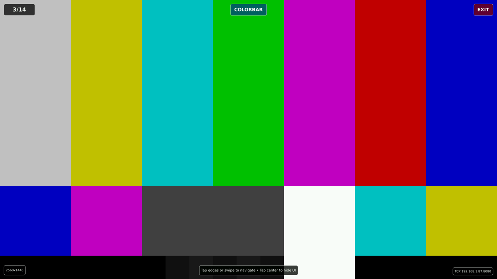

# Qt Pattern Generator(QT-Pattern Backend)

A Qt5-based display pattern generator application designed for testing displays color accuracy, and display uniformity. Features touch navigation and TCP network interface for automated testing integration.


## Features

- **15 Test Patterns**: Comprehensive pattern library for display testing
- **Touch Navigation**: Intuitive touch interface with forward/backward navigation  
- **Network Control**: TCP socket interface for automated testing
- **Auto-scaling**: Adapts to any display resolution
- **Fullscreen Mode**: Clean, distraction-free pattern display
- **Embedded Optimized**: Designed for embedded Linux systems

## Supported Patterns

### **Basic Test Patterns**
- **grayscale-ramp**: 16-step grayscale gradient for brightness calibration
- **ansi-checker**: Black/white checkerboard for uniformity testing  
- **colorbar**: SMPTE color bars for color accuracy testing

### **Solid Color Patterns**
- **white**: Full white screen (255,255,255)
- **black**: Full black screen (0,0,0)
- **red**: Full red screen (255,0,0)
- **green**: Full green screen (0,255,0)
- **blue**: Full blue screen (0,0,255)
- **cyan**: Full cyan screen (0,255,255)
- **magenta**: Full magenta screen (255,0,255)
- **yellow**: Full yellow screen (255,255,0)

### **Advanced Display Testing**
- **zone-boundary-grid**: Grid pattern for local dimming zone mapping (1008 zones, configurable)
- **blooming-detection**: Single pulsing pixel for blooming measurement
- **cross-dimming**: 4 corner spots with pulsing animation for zone interference testing

### **Custom Patterns**
- **RGB patches**: Custom colors with `pattern rgb R G B` (values 0-255)

## Installation

### Dependencies
- **Qt5**: qt5base, qt5declarative, qt5quickcontrols2
- **Platform**: Linux with framebuffer support (linuxfb)
- **Touch**: Standard Linux input events (`/dev/input/eventX`)

### Build Methods

#### **Option 1: Buildroot Package**
The application can be integrated as a Buildroot package for embedded systems.

#### **Option 2: Standalone Build**
```bash
cd src/
qmake
make
./disp-tester --port=8080
```

For cross-compilation, ensure Qt5 development tools and target toolchain are configured.

## Usage

### Command Line Options
```bash
qt-pattern-generator [options]

Options:
  -p, --port <port>     TCP server port (default: 8082)
  --script <program>    Start a supervised child script/program
  --script-arg <arg>    Argument for the child script (repeatable)
  -h, --help            Display help
  -v, --version         Display version
```

### Supervised Child Script

`disp-tester` can optionally start one child script after the UI and TCP
server are ready:

```bash
./disp-tester --port=8082 --script /usr/bin/my-measurement.sh \
  --script-arg sequence-a --script-arg panel-42
```

The child inherits the normal environment plus:

- `DISP_TESTER_HOST=127.0.0.1`
- `DISP_TESTER_PORT=<configured port>`

The parent never waits synchronously for the child while the Qt event loop is
running. On touch exit, TCP `quit`, SIGTERM, or SIGINT, `disp-tester` sends
SIGTERM to the child and falls back to SIGKILL after 3 seconds.

### ALS Dimmer Sweep Child Script

The package also installs `/usr/bin/als-dimmer-sweep-child.py`, a simplified
child-script variant of the ALS brightness-to-nits sweep. It assumes
`disp-tester` is already running as its parent, sets a white pattern through
the parent socket, drives `als-dimmer`, records `spotread` results to CSV, and
leaves `disp-tester` open with a completion overlay when the sweep finishes.

Example through `disp-tester`:

```bash
disp-tester --script /usr/bin/als-dimmer-sweep-child.py \
  --script-arg=--output --script-arg=/tmp/sweep.csv \
  --script-arg=--label --script-arg=warm
```

For `qt-demo-launcher` JSON, pass script options with the `--script-arg=...`
form, especially for values that begin with `--`:

```json
"program": "/usr/bin/disp-tester",
"arguments": [
  "--script", "/usr/bin/als-dimmer-sweep-child.py",
  "--script-arg=--output", "--script-arg=/tmp/sweep.csv",
  "--script-arg=--label", "--script-arg=warm"
]
```

The script handles SIGTERM/SIGINT by stopping any active `spotread`, restoring
the original ALS dimmer mode/brightness when possible, flushing the partial
CSV, and exiting. It does not send `quit` to `disp-tester`.

Before starting the sweep, the child script checks `/sys/bus/usb/devices` for
an i1 Display Pro style USB colorimeter. The known i1 Display Pro USB ID
`0765:5020` is accepted by default. If it is not found, the script leaves
brightness untouched and shows an `i1 Display Pro Not Found` message in the
bottom-right info box. Use `--no-require-colorimeter` only for dry-runs or
lab debugging.

During the sweep, the script re-checks USB presence before each measurement
step. This is only a sysfs scan, so the cost is negligible compared with the
brightness settle time and `spotread`; if the colorimeter disappears, the
partial CSV is preserved, calibration install is skipped, and the info box
shows `i1 Display Pro Disconnected`.

Each row can also include `backlight_temp_c`. By default the script probes
`/dev/i2c-1`, slave `0x66`, register `0x1002`, and reads the display_manager
backlight NTC temperature as signed big-endian `degC x10`. If that I2C slave
is not present or a row read fails, the temperature field is left blank and
the sweep continues. Use `--no-i2c-temp` to disable this native probe, or
`--temp-cmd` to override it with a custom temperature command.

For local-dimming displays, `spotread` can fail at the final 0% black reading
even when the preceding low-brightness rows are valid. By default, a failed
measurement at exactly 0% is tried once, then written as `0.0000` nits with
`OK` status if `spotread` cannot parse a value. This avoids a long low-light
retry cycle that can make the i1 Display Pro disappear briefly from USB. Other
brightness levels remain strict failures. Use `--zero-nits-max-retries` to tune
the 0% retry count, or `--no-zero-nits-on-zero-fail` to disable this fallback.

After the USB check passes, the script sets the display to a white pattern and
100% brightness, then waits until `spotread` sees at least 250 nits. This is a
placement check for the colorimeter: if the reading is too low, the bottom-right
info box asks the user to place the i1 Display Pro at the center of the lit
screen. The default wait has no timeout and can be cancelled with the on-screen
EXIT button. Use `--placement-min-nits`, `--placement-timeout-seconds`, or
`--no-placement-check` to tune this behavior.

To apply a successful sweep automatically, add `--install-calibration`. The
child script resolves `/home/pi/als-dimmer/etc/als-dimmer/config.json` and
copies the CSV into the matching calibration target:

- `config_fpga_opti4001_dimmer2048.json` -> `calibrations/dimmer_2048.csv`
- `config_opti4001_boepwm.json` -> `calibrations/boe_pwm_2khz_reference.csv`
- any other config -> `calibrations/dimmer_2048.csv`

It then runs `systemctl restart als-dimmer`. If the script is not running as
root, it uses `sudo -n` so it fails quickly instead of waiting for a password.
Before copying, the script re-opens the CSV on disk and checks that the header,
row count, brightness steps, row status, nits values, and 100% brightness sanity
look valid. A partial or broken `/tmp/warm.csv` is not copied over the existing
calibration. After the copy and restart succeed, the info box shows
`Brightness Calibration Success`.

```json
"arguments": [
  "--script", "/usr/bin/als-dimmer-sweep-child.py",
  "--script-arg=--output", "--script-arg=/tmp/warm.csv",
  "--script-arg=--label", "--script-arg=warm",
  "--script-arg=--warmup-seconds", "--script-arg=5",
  "--script-arg=--install-calibration"
]
```

### Live Measurement Child Script

The package also installs `/usr/bin/live-measurements-child.py`, a read-only
child script for live spot checks. It shows a white pattern, repeatedly takes
one `spotread` xyY sample, reads backlight temperature from the display-manager
I2C diagnostics register when available, reads `als-dimmer` status plus
`get_absolute_brightness` for brightness percent and absolute nits, and updates
the bottom-right overlay. It does not change ALS mode, brightness, or
calibration.

```bash
disp-tester --script /usr/bin/live-measurements-child.py \
  --script-arg=--interval-seconds --script-arg=2.0
```

The update cadence is one `spotread` attempt, immediate overlay update, then
`--interval-seconds` sleep before the next attempt. The default interval is 2s;
use `--interval-seconds 0` only for short lab/debug runs.

The live overlay uses the normal metadata color when readings are healthy and
turns the whole overlay red for sensor read errors, ALS read errors, or when
the measured-vs-ALS delta exceeds `--delta-alert-percent` (default 5%).
Spotread failures are shown as a short `Measured: sensor error` line so the
overlay size stays stable.

### Touch Navigation
- **Left edge tap** (25%): Previous pattern
- **Right edge tap** (25%): Next pattern  
- **Center tap** (50%): Toggle UI overlay
- **Swipe left**: Next pattern
- **Swipe right**: Previous pattern

### UI Elements
- **Pattern counter**: Shows current position (e.g., "5/15")
- **Pattern name**: Displays current pattern (e.g., "RED")
- **EXIT button**: Always available in top-right corner
- **Resolution info**: Display dimensions (e.g., "2560x1440")
- **Network info**: TCP server status (e.g., "TCP:192.168.1.100:8080")
- **Auto-hide**: UI disappears after 4 seconds, tap center to toggle

## Network API

### Connection
```bash
# Telnet (interactive)
telnet <display-ip> 8080

# Netcat (scripting) 
echo "pattern red" | nc -q 1 <display-ip> 8080
```

### Pattern Commands
```bash
# Basic patterns
pattern grayscale-ramp      # 16-step grayscale gradient
pattern ansi-checker        # Black/white checkerboard
pattern colorbar            # SMPTE color bars

# Solid colors
pattern white               # Full white screen
pattern black               # Full black screen  
pattern red                 # Full red screen
pattern green               # Full green screen
pattern blue                # Full blue screen
pattern cyan                # Full cyan screen
pattern magenta             # Full magenta screen
pattern yellow              # Full yellow screen

# Advanced patterns
pattern zone-boundary-grid  # Local dimming zone grid
pattern blooming-detection  # Single pixel blooming test
pattern cross-dimming       # Zone interference test

# Custom RGB
pattern rgb 255 128 64      # Custom color (R G B values 0-255)

# Bottom-right metadata text overlay
set-metadata-text <message>            # Set the overlay text (literal \n becomes newline)
clear-metadata-text                    # Clear back to default IP:port display
set-metadata-status <autohide|enable|disable>  # Visibility mode (autohide is default)
get-metadata-status                    # Read current visibility mode
get-metadata-text                      # Read current text (default = empty)
set-metadata-align  <left|center|right>
set-metadata-fontsize <8..48>
set-metadata-color  <r> <g> <b>        # OR set-metadata-color <named-color>
get-metadata-align
get-metadata-fontsize
get-metadata-color
```

### Information Commands
```bash
get-resolution              # Returns display resolution
get-pattern                 # Returns current pattern name  
list-patterns              # Returns all available patterns
quit                       # Exit application
```

### Response Format
```bash
OK                         # Command successful
ERROR: <description>       # Command failed
<data>                     # Information response
```

### Connection Model & Pitfalls

These are easy to miss and have bitten clients in the past. Read them
before writing automation against this daemon.

**1. Single client at a time.** disp-tester accepts exactly one TCP
client. While that client is connected, additional `connect()` attempts
are accepted-and-immediately-closed (no error code, no response) until
the existing client disconnects. Symptom from the client side: connect
succeeds, send may succeed, recv returns 0 immediately. From disp-tester's
debug log: `Rejecting connection - client already connected`.

**2. ~100ms close-detection latency.** disp-tester polls its client
socket every 100ms. After a client closes its end, disp-tester takes up
to ~100ms to notice and free the slot for the next connect. **A new
connect that arrives inside that window gets silently rejected** by
mechanism #1 above.

What this means for clients:

- **Use one connection for many commands** when possible. The protocol
  is line-based, so one TCP session can carry an arbitrary number of
  newline-terminated commands and read each `OK` / `ERROR: ...` /
  data-line reply in turn. This avoids the rate-limit entirely.
- **If you must use one connect-per-command**, leave at least **150ms
  between successive connections**. Tools that fire commands in tight
  loops (e.g. shell `for ... done` with `nc`, or rapid Python
  `subprocess.run`) WILL hit silent drops if you don't.
- **Treat overlay updates as best-effort**. When a drop happens, the
  command is lost without notification. Don't rely on every per-step
  text update landing — use the message content for "current state",
  not "history of state transitions".

If you've already taken the one-connection-per-command path and your
calls are landing back-to-back, a quick `time.sleep(0.15)` between
connections is the simplest fix.

## Text Overlay Feature

### Overview
The application supports displaying custom text messages in a semi-transparent overlay box positioned at the bottom-right corner of the screen. This feature is useful for:
- **Test identification**: Label different test sequences
- **Measurement notes**: Display current test parameters
- **Status information**: Show testing progress or conditions
- **Documentation**: Add context to recorded test results

### Two-Step Setup — Read This First

A correct overlay-up sequence requires **both** a text and a status call:

```bash
# 1. Set the text. Without step 2 the overlay stays hidden.
echo 'set-metadata-text Hello World' | nc -q 1 $HOST $PORT
# 2. Make the overlay always visible. Default is `autohide` which follows
#    the on-screen UI: visible for 4s after touch, then hidden.
echo 'set-metadata-status enable' | nc -q 1 $HOST $PORT
```

Skipping step 2 is the most common mistake: text gets set, but the overlay
hides as soon as the auto-hide timer fires. If you want classic
"only on touch" behavior, leave the status at `autohide`.

### Overlay Commands
```bash
# Text content - everything after the first space is the message
set-metadata-text <message>          # literal \n becomes a newline
clear-metadata-text                  # back to default (IP:port display)
get-metadata-text                    # read current text (literal \n returned)

# Visibility mode
set-metadata-status <mode>           # mode: autohide | enable | disable
get-metadata-status                  #   autohide = follow main UI visibility
                                     #   enable   = always visible
                                     #   disable  = always hidden

# Cosmetics
set-metadata-align    <left|center|right>
set-metadata-fontsize <8..48>
set-metadata-color    <r> <g> <b>    # 0..255 each
set-metadata-color    <named>        # e.g. red, green, blue, white, ...
get-metadata-align
get-metadata-fontsize
get-metadata-color                   # returns "r g b"
```

### Overlay Behavior
- **Position**: Bottom-right corner with 20px margins (fixed, not configurable)
- **Background**: Semi-transparent black (80% opacity)
- **Default text color**: White; configurable via `set-metadata-color`
- **Default font size**: 16px; configurable 8-48 via `set-metadata-fontsize`
- **Auto-sizing**: Box adjusts to text content
- **Persistence**: Text and status are sticky across `pattern` commands
- **Reset**: Closing/restarting disp-tester resets all metadata to defaults
  (status=autohide, text="", align=center, fontsize=16, color=white)

### Default Text vs Custom Text
When `set-metadata-text` has been given a non-empty string, that string is
shown. When the text is empty (initial state, or after `clear-metadata-text`),
the box shows the daemon's listening `IP:port` instead — handy for clients
that need to discover where to connect.

### Examples

#### Test Sequence Labeling
```bash
#!/bin/bash
HOST="192.168.1.100"
PORT="8080"

# One-time setup: keep overlay visible regardless of UI auto-hide
echo "set-metadata-status enable" | nc -q 1 $HOST $PORT

# Per-step: update text and pattern
echo 'set-metadata-text Color Accuracy Test - Sequence 1' | nc -q 1 $HOST $PORT
echo "pattern red"   | nc -q 1 $HOST $PORT
sleep 3

echo 'set-metadata-text Color Accuracy Test - Sequence 2' | nc -q 1 $HOST $PORT
echo "pattern green" | nc -q 1 $HOST $PORT
sleep 3

echo 'set-metadata-text Color Accuracy Test - Sequence 3' | nc -q 1 $HOST $PORT
echo "pattern blue"  | nc -q 1 $HOST $PORT
sleep 3

# Cleanup
echo "clear-metadata-text"        | nc -q 1 $HOST $PORT
echo "set-metadata-status autohide" | nc -q 1 $HOST $PORT
echo "quit"                       | nc -q 1 $HOST $PORT
```

#### Multi-line Measurement Parameters
```bash
echo "set-metadata-status enable" | nc -q 1 $HOST $PORT
echo 'set-metadata-text Ambient: 2 lux\nViewing Angle: 0\nDistance: 60cm' | nc -q 1 $HOST $PORT
echo "pattern white" | nc -q 1 $HOST $PORT
```

Note: the literal two-character sequence `\n` (backslash + n) inside the
message is what disp-tester converts to a newline. If your shell expands
`\n` before disp-tester sees it (e.g. `printf '%b'` or `echo -e`), the
overlay will show one collapsed line.

### Text Formatting Guidelines
- **Keep text concise**: Overlay should not obscure test patterns
- **Use \n for line breaks**: As literal backslash + n
- **Avoid embedded `"` and `'`**: Quoting at the wire layer is not parsed
  - the message is everything from `set-metadata-text ` to end-of-line
- **Consider contrast**: Default white on semi-transparent black
- **Length limits**: Not enforced; keep under ~200 characters for readability

### Python Client Example

```python
import socket
import time

def send_command(host, port, command, timeout=2.0):
    """Open a single TCP connection, send one newline-terminated command,
    read the response. Returns the daemon's reply string ('OK', 'ERROR: ...',
    or a data line)."""
    with socket.create_connection((host, port), timeout=timeout) as s:
        s.sendall((command + "\n").encode())
        return s.recv(1024).decode().strip()

def run_color_test(host, port):
    colors = ['red', 'green', 'blue', 'cyan', 'magenta', 'yellow']

    # One-time: enable always-on overlay
    send_command(host, port, "set-metadata-status enable")

    for i, color in enumerate(colors):
        msg = f"Color Test\\nStep: {i+1}/{len(colors)}\\nCurrent: {color.upper()}"
        send_command(host, port, f"set-metadata-text {msg}")
        send_command(host, port, f"pattern {color}")
        time.sleep(2)

        # Stay outside disp-tester's 100ms accept-rate window between
        # back-to-back connects (see "Connection Model" section).
        time.sleep(0.15)

    send_command(host, port, "clear-metadata-text")
    send_command(host, port, "set-metadata-status autohide")

run_color_test('192.168.1.100', 8080)
```

## Pattern Details

### Zone Boundary Grid
- **Default**: 42×24 grid (1008 zones)
- **Zone size**: 60×60 pixels on 2560×1440 displays
- **Alignment**: Centered grid with perfect LED alignment
- **Configurable**: Grid dimensions can be modified for different display types
- **Zone numbering**: 0-1007, matches physical LED array indexing

### Blooming Detection
- **Single pixel**: 2×2 white pixel in display center
- **Pulsing animation**: Opacity varies between 70%-100% for visibility
- **Crosshairs**: Dim positioning guides for precise measurement
- **Purpose**: Detect light bleeding around bright pixels

### Cross Dimming
- **Four spots**: 60×60 white circles in display corners  
- **Pulsing behavior**: Each spot pulses at staggered intervals
- **Animation timing**: 1500ms, 1700ms, 1900ms, 2100ms cycles
- **Purpose**: Test local dimming zone interference and interaction

## Network Integration Examples

### Basic Pattern Testing
```bash
#!/bin/bash
HOST="192.168.1.100"
PORT="8080"

# Test primary colors
for color in red green blue; do
    echo "Testing $color..."
    echo "pattern $color" | nc -q 1 $HOST $PORT
    sleep 2
done

echo "quit" | nc -q 1 $HOST $PORT
```

### Display Information
```bash
# Get display specs
RESOLUTION=$(echo "get-resolution" | nc -q 1 192.168.1.100 8080)
PATTERNS=$(echo "list-patterns" | nc -q 1 192.168.1.100 8080)

echo "Display: $RESOLUTION"  
echo "Available: $PATTERNS"
```

### Automated Testing Session
```bash
# Multi-command session
{
    echo "pattern white"
    echo "pattern black"  
    echo "pattern zone-boundary-grid"
    echo "get-pattern"
    echo "quit"
} | nc 192.168.1.100 8080
```

## Technical Architecture

### Application Structure
- **Qt5 + QML**: Modern UI framework with hardware acceleration
- **C++ Backend**: Pattern management and network interface
- **POSIX Sockets**: Dependency-free TCP server implementation
- **Touch Input**: Standard Linux input event handling
- **Framebuffer**: Direct rendering via linuxfb platform

### Pattern System
- **Modular Design**: Individual QML files for each pattern
- **Auto-scaling**: Patterns adapt to any display resolution
- **Resource Efficient**: Optimized for embedded systems
- **Clean Display**: UI elements hidden during pattern display

### Network Protocol
- **Text-based**: Simple command/response format
- **Single client**: One connection at a time
- **Line-terminated**: Commands end with newline
- **Immediate feedback**: Instant OK/ERROR responses

## Development

### Source Structure
```
src/
├── main.cpp                # Application entry point
├── PatternController.cpp/h # Pattern management and network
├── NetworkInterface.cpp/h  # TCP server implementation  
├── main.qml               # Main UI and navigation
├── patterns/              # Pattern QML files
└── qml.qrc               # Resource compilation
```

### Build Configuration
- **qmake project**: Standard Qt5 build system
- **Cross-compilation**: ARM toolchain supported
- **Resource embedding**: All QML files compiled into binary
- **Platform**: Targets linuxfb for embedded deployment

### Customization
- **Add patterns**: Create new QML files in `patterns/` directory
- **Modify grid**: Adjust zone dimensions in `ZoneBoundaryGrid.qml`  
- **Network port**: Configurable via command line option
- **UI styling**: Modify overlay appearance in `main.qml`

## Platform Support

### Tested Configurations
- **Raspberry Pi 4**: HDMI output, capacitive touch input
- **Custom embedded**: ARM-based systems with Qt5 support
- **Display interfaces**: HDMI, DSI, and framebuffer-compatible outputs
- **Input devices**: Touch screens via `/dev/input/event*`

### Requirements
- **RAM**: Minimum 512MB, recommended 1GB+
- **Storage**: ~10MB application + Qt5 runtime libraries
- **Display**: Any resolution, auto-scaling support
- **Network**: Ethernet or WiFi for remote control (optional)

---

**Qt Pattern Generator** - Professional display testing made simple.
