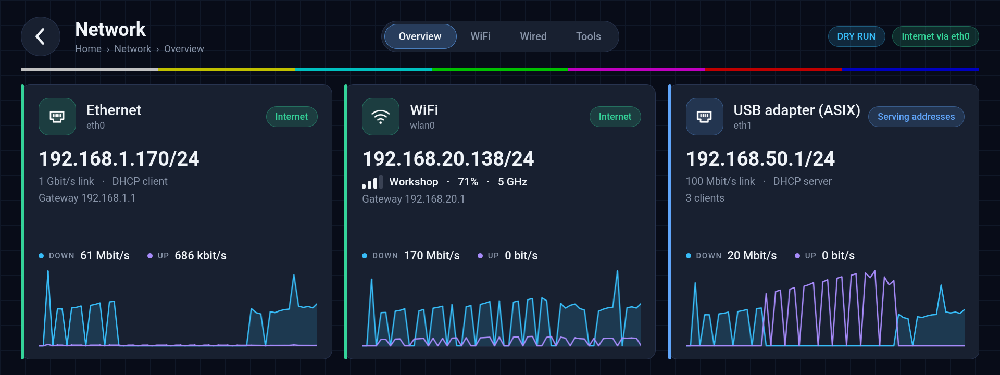

# network-manager-app

**Network** for the display rig: what every network interface is doing, WiFi (scan, join, saved
networks, hidden networks), each wired port's mode (DHCP client, fixed address, DHCP server), and
bench diagnostics (ping, an internet check, iperf3). The launcher's **Network** tile, second row
of screen 2. Built the way `system-manager-app` is built; the design is
`docs/network-manager-app-plan.md` (its closing section lists where the build differs).



## What each section does

- **Overview** — a card per interface (built-in port first, then WiFi, then USB adapters by
  name): its role (Internet, Connected, Connected no internet, Fixed address, Serving addresses,
  No cable…), address, link speed or signal, a 60-second traffic sparkline; tap for every detail
  (MAC, gateway, DNS, lease, IPv6). The header says "Internet via eth0" or "No internet".
- **WiFi** — the radio switch with the regulatory country; networks in range (strongest access
  point per name, band, security, saved); join with the on-screen keyboard (every printable
  ASCII character), a hidden network by name, saved networks with auto-connect and Forget. A
  refused password brings the password sheet back with what was typed. Enterprise and OWE
  networks are listed but not joined. When WiFi carries this rig's only address or its default
  route, the section says what Disconnect, Forget or WiFi off would cut.
- **Wired** — each port's mode: **Automatic (DHCP client)**, **Fixed address** (address,
  prefix, gateway and DNS on the numeric pad), **DHCP server** (hands out `.10–.254`, one-hour
  leases, no gateway, no DNS). The line above **Hold to apply** says what will happen, including
  the address this rig loses. Before a port starts serving, the section asks the network whether
  another DHCP server is there and says so; a serving port shows its lease table, with a **Ping**
  per client and **Reserve** / **Release**: a reserved client always gets the same address
  (marked in the table; a reserved client with no lease has a row of its own, and one that still
  holds another address shows where it moves). **Reserve for a MAC…** reserves for a client that
  is not in the table: its MAC (colons optional), then the address on the pad. A port the OLED menu put in its own server mode is shown as such, with that
  server's leases, and taken over by any of the three modes.
- **Tools** — **Ping** (ten packets, one box per reply or loss as it happens; targets: gateways,
  the clients of serving ports, two public resolvers, or a typed address or name; optionally
  from one port); **Internet check** through one port (its gateway answers → its own DNS server
  finds `www.google.com` → `https://www.google.com/generate_204` answers 204), each step with
  its time or, in plain words, why it failed; **Speed test** with iperf3, as the server (the
  command to run on the other machine, one line per address, live Mbit/s) or as the client
  (5/10/30 s, TCP or UDP at 100 Mbit/s, either direction; live graph, then the summary). One tool
  at a time; leaving Tools or the app stops it.

## Pieces

| File | What |
|---|---|
| `src/net-ctl.sh` | the only thing that talks to NetworkManager (`nmcli`); POSIX `sh`, line protocol `RESULT` / `PROGRESS` / `NOTICE` |
| `src/net-dhcp-probe.py` | one DHCPDISCOVER on a port, every DHCPOFFER for 4.5 s; never a REQUEST (`--self-test` checks the packet code) |
| `src/net-badge.sh` | the launcher tile's `available_command` and `badge_command` |
| `src/90-net-ctl-guard.in` | the DHCP guard's NetworkManager dispatcher script (installed to `share/network-manager-app/`; the image copies it to `/etc/NetworkManager/dispatcher.d/`) |
| `src/NetTool.*` | runs `net-ctl.sh` (one command at a time per controller), parses its lines, logs to `/tmp/network-manager-app.log` |
| `src/StatusController.*` | Overview and header: `status`, `monitor`, `leases`; byte counters and carrier from `/sys/class/net` once a second |
| `src/WifiController.*` | WiFi section: `wifi-scan`, `wifi-connect` (password on stdin), `wifi-forget`, `wifi-autoconnect`, `wifi-disconnect`, `wifi-radio` |
| `src/WiredController.*` | Wired section: `wired-set`, `dhcp-probe`, the lease table of a serving port |
| `src/ToolsController.*` | Tools section: `ping`, `internet-check`, `iperf-server`, `iperf-client` |
| `src/main.qml`, `src/Keyboard.qml`, `src/NumPad.qml` | the page; the keyboard (layers abc / ABC / 123 / #+=) and the numeric pad (keys act on press) |

Reads run as the app user; changes, the lease table and the internet check run as
`sudo -n net-ctl.sh …`. A WiFi password goes to the script on stdin and from there to
`nmcli … passwd-file /dev/stdin` — never in an argument list or a log.

**A change outlives the app** (plan rule 6a): run as root with `systemd-run` present, a change
re-executes itself as a transient unit (`systemd-run --pipe --wait`), so a launcher restart (which
SIGKILLs the app's whole cgroup) cannot stop it between "modified" and "up or restored". It prints
`NOTICE detached` first; its NOTICE and RESULT lines also go to the journal (`journalctl -t
net-ctl.sh`), since nobody may be reading any more. `NET_CTL_*` variables are carried into the
unit. While a detached WiFi change runs, Back and Escape stay usable; without `systemd-run`
(Buildroot) a change runs in place and the app stays until it has finished. Reads and tools never
detach.

**A tool stops with the app.** `ping` and `iperf3` run under `net-ctl.sh`, which stops them on
TERM/HUP/INT and — since a SIGKILL reaches nobody — when its caller is gone (checked every
second, as `monitor` does). On the rig, `kill -KILL` of the app while its iperf3 server ran left
no `iperf3` and no `net-ctl.sh` behind.

## The launcher tile

In `qt-demo-launcher-pios.json`: `id` `network`, row 4 column 0 (second row of screen 2), icon
`icons/network.svg` of the launcher's set, accent `#38BDF8`.

- `available_command`: `net-badge.sh --available` — exit 0 when `net-ctl.sh available` says
  NetworkManager is there; else it prints `Needs NetworkManager` and the launcher dims the tile
  with that subtitle (taps are ignored; the API's `start-app` still starts it).
- `badge_command`: `net-badge.sh` — `Serving stopped: eth1` when the DHCP guard took a serving
  port down, else `Serving addresses` while a port hands out addresses
  (NetworkManager's shared-mode dnsmasq, or the OLED menu's server), nothing otherwise. Being
  offline is not badged: a bench rig is often offline on purpose. No `nmcli`, no `sudo`, no
  ping: a process list and a file test, 36 ms on the rig (`--available` 54 ms).

`qt-demo-launcher.json` (the Buildroot launcher config) lists a smaller set of tiles — no System
Manager, no USB Media — and gets no Network tile: the app needs NetworkManager, which that image
does not run.

## net-ctl.sh

Exit codes: `0` done · `1` refused (bad arguments, update lock held, unsupported security, a
password is needed, an overlapping subnet) · `2` failed, nothing changed · `3` failed, the
previous settings were restored · `4` NetworkManager not available.

| Command | Root | Output |
|---|---|---|
| `available` | no | `RESULT kind=available ok=0\|1 [reason=…]` |
| `status` | no | `RESULT kind=iface …` per wired/WiFi device (incl. `inet=yes\|no`, the configured profile `profileuuid= cfgprofile= saved= binding=name\|mac\|any cfgip= cfgprefix= cfggateway= cfgdns=`), then `RESULT kind=summary internet= via= defaultdev= wifi= country= volatile= wifiboot= wifikept=` (`wifikept=1`: the switch is kept across restarts, `/data/network` exists) |
| `monitor` | no | `NOTICE changed` on every NetworkManager event, until killed (or until its caller is gone) |
| `leases --iface=` | yes | `RESULT kind=lease ip= mac= host= expires=` …, `RESULT kind=reservation mac= ip=` per reservation in the port's network, `RESULT kind=leases count=`; the OLED menu's server: from the system dnsmasq's lease file |
| `dhcp-reserve --iface= --mac= --ip=` / `--iface= --mac= --forget` | yes | a change: `RESULT kind=reservation iface= mac= ip= action=added\|removed\|unchanged [reason=bad-arguments\|in-use\|not-serving\|legacy-server\|unsupported\|locked]` |
| `wifi-scan [--rescan]` | rescan | `RESULT kind=ap ssid= signal= security= band= saved= active=` (strongest BSSID per SSID), then `RESULT kind=saved …` per profile |
| `wifi-connect --ssid= [--hidden] [--security=open\|wpa2\|wpa3]` | yes | `PROGRESS phase=associating\|authenticating\|address`, `RESULT kind=connect ok= … [reason=bad-password\|not-found\|no-address\|timeout\|unsupported\|need-password\|radio-off\|locked]` |
| `wifi-disconnect`, `wifi-forget --ssid=`, `wifi-autoconnect --ssid= --on\|--off`, `wifi-radio --on\|--off` | yes | `RESULT kind=… ok=`. `wifi-radio` keeps the choice in `/data/network/wifi-radio.state` where that directory exists (the A/B image) |
| `wifi-radio-restore` | yes (boot) | run by `micropanel-wifi-radio-restore.service` before NetworkManager starts (the template is installed to `share/network-manager-app/`; the image hook puts it in `/etc/systemd/system`): a kept `off` becomes `WirelessEnabled=false` in NetworkManager's state file; otherwise nothing. `RESULT kind=radio-restore wifi=off\|default` |
| `wired-set --iface= --mode=client` | yes | `PROGRESS phase=activating\|checking`, `RESULT kind=wired ok= ip= binding= [reason=activation-failed\|check-failed\|overlap\|bad-arguments\|locked]` |
| `wired-set --iface= --mode=static --ip= --prefix= [--gateway=] [--dns=a,b]` | yes | as above |
| `wired-set --iface= --mode=server --ip= [--prefix=24]` | yes | as above; stops and masks the system `dnsmasq.service` and writes the no-gateway drop-in if needed |
| `dhcp-guard --iface= --event=pre-up\|check\|expire\|down` | yes | the DHCP guard (the dispatcher script calls it): `RESULT kind=guard iface= action=none\|checking\|serving\|stopped [server=]` |
| `dhcp-guard --iface= --retry` | yes | a change: the port up again, the guard decides; `action=serving\|stopped` |
| `dhcp-probe --iface=` | yes | `RESULT kind=offer server= offered= router=` per other server, `RESULT kind=probe servers=N carrier=0\|1` |
| `ping --target= [--iface=] [--count=1..100]` | no | `RESULT kind=reply seq= ms= from=` / `kind=lost seq= [reason=unreachable]` as they happen, then `kind=ping target= sent= received= avg= loss= [reason=unknown-host\|unreachable\|bad-interface]` |
| `internet-check [--iface=]` | binds | `RESULT kind=check step=gateway\|dns\|https ok= [ms= target= server= addr= code=] [reason=…]` per step, then `kind=internet iface= ok=`; without `--iface` the default route's port |
| `iperf-server --start\|--stop` | no | `kind=iperf-server running=1 port=5201 addrs=…`, per client `kind=iperf-peer from=`, `kind=iperf interval= mbit=` per second, `kind=iperf-sum role=receiver …`; `reason=port-busy` when 5201 is taken |
| `iperf-client --host= [--secs=5\|10\|30] [--udp] [--reverse]` | no | `kind=iperf interval= mbit=` per second, `kind=iperf-sum role=sender\|receiver mbit= [retr=] [jitter= lost= packets=]`, `kind=iperf-done ok= [reason=refused\|unreachable\|server-busy\|unknown-host]` |

Values are percent-encoded (every byte outside `[A-Za-z0-9._~:/,@+-]`); `--ssid=` takes the same
encoding. Changes take `--dry-run`. A `--target=`/`--host=` is an address or a host name: letters,
digits, `.`, `:`, `_`, `-`, not starting with `-`. MAC addresses are upper case everywhere
(`status`, `leases`), as NetworkManager prints them; dnsmasq's lower-case lease file is converted.

### Wired ports

`wired-set` edits the profile NetworkManager has active on the port, else the autoconnect profile
that would activate there, else a new one — the same rule as the OLED menu's script. It records
the profile's IPv4 settings, applies the new ones, brings the port up and checks the result
(client: an address; static: that address; server: see below). If the activation or the check
fails, the old settings go back and the port comes up again: exit 3. A port with no cable is only
saved (`pending=1`). A DHCP client can wait up to 45 s for an address; the card says so.

The first `wired-set` turns NetworkManager's in-memory auto profile into a saved one (on `/data`
on the A/B image). A **USB adapter's** profile is bound to its MAC address and loses its
interface-name binding, so the adapter keeps its settings in any port and another adapter does
not inherit them; the built-in `eth0` keeps its name binding.

### DHCP server

Server mode is NetworkManager's shared mode (`ipv4.method shared`) with `dhcp-option=3` and
`dhcp-option=6` emptied by `/etc/NetworkManager/dnsmasq-shared.d/90-micropanel-no-gateway.conf`:
clients get an address (`.10–.254`, one hour) and no router, no DNS — a bench PC keeps its own
internet. Measured on the rig (NetworkManager 1.42.4):

- **The system dnsmasq blocks shared mode.** With `dnsmasq.service` running, NetworkManager's
  own dnsmasq cannot bind port 53 and the activation fails. `wired-set` stops and masks the
  service first (the image's network hook masks it at build time).
- **The success check reads dnsmasq's command line.** A serving port counts as up when the port
  has its address, the drop-in exists, and a dnsmasq runs with `--listen-address=<ip>` and
  `--conf-dir=/etc/NetworkManager/dnsmasq-shared.d` — the arguments NetworkManager 1.42.4 starts
  it with. A later NetworkManager that starts it differently would fail this check, and every
  server-mode apply would be restored (exit 3) until the check is updated; `pgrep -a dnsmasq`
  on the new version shows what to match. `net-badge.sh` keys on the same `--conf-dir`.
- **A second DHCP server moves a rig's address.** On a shared LAN, a client of the rig's server
  may take an address another server also hands out, and a rig on DHCP can lose its own. Hence
  the probe before serving (one DISCOVER, every OFFER within 4.5 s — a dnsmasq once took 3.1 s
  with its ping check), a warning that names the other server, and a probe again whenever a
  serving port's cable comes in while the Wired section is shown.
- **The OLED menu** (micropanel's `dhcp-net-settings.sh`) goes through `net-ctl.sh` on Pi OS
  when it finds it (`$NET_CTL`, `PATH`, `$MICROPANEL_HOME/bin`, `/usr/bin`) and NetworkManager is
  available: its server is then this shared mode too. Without them it works as before:
- **The OLED menu's old server** (`dhcp-net-settings.sh --mode=dhcp-server`) is the system dnsmasq
  with `/etc/dnsmasq.d/micropanel-dhcp-server.conf`, `.100–.200`, 12-hour leases, the rig as
  gateway. `status` reports such a port as `mode=legacy-server`; the app shows it as "DHCP
  server (set from the panel menu)" with that server's leases. Any `wired-set` on it first does
  what the menu's own stop does (stop and mask dnsmasq, remove its conf), then the new mode —
  run for real on a veth pair for all three modes. The card's tiles show what Apply would set
  up, not the menu server's own range.
- `wired-set` refuses a server subnet that overlaps another port's.

### Reserved addresses

A reservation pins the address a serving port gives one client, by its MAC. The image ships a
second drop-in, `91-micropanel-reservations.conf`, with
`dhcp-hostsfile=/var/lib/micropanel/dhcp-reservations`; `dhcp-reserve` writes `MAC,ip` lines
there (atomically, `0644` — NetworkManager's dnsmasq runs as `nobody`) and sends `SIGHUP` to the
port's dnsmasq (`/run/nm-dnsmasq-<port>.pid`), which re-reads the file. Nothing is restarted
and the port stays up. Measured with bookworm's dnsmasq and on rig 1 (NetworkManager 1.42.4):

- **SIGHUP is enough for a hostsfile, not for the drop-in directory.** A `dhcp-host=` line in a
  file under `dnsmasq-shared.d` is read only when dnsmasq starts, i.e. when the port is
  re-activated (the link drops); the same line in the hostsfile is applied by `SIGHUP` — added
  and removed alike. A missing hostsfile is logged ("cannot read …") and is not fatal.
- **One file for every port.** A port's dnsmasq applies only the lines in its own network; the
  others are ignored there. `leases` shows each port's own.
- **Outside the pool is fine.** The address must be in the port's network (not its own address,
  not the network or broadcast address); it need not be in `.10–.254` — `.2` works.
- **When the client moves.** A client that holds another address keeps it until it renews (half
  the one-hour lease) or reconnects; dnsmasq then refuses the old address and hands out the
  reserved one. A device on a fixed address (the Xavier, `192.168.10.2`) never asks; its
  reservation is a note to everyone else's leases, which then never get that address.
- **Refused:** an address reserved for another MAC or leased to another client (`in-use`), a port
  that does not serve (`not-serving`), the OLED menu's own server (`legacy-server`: the system
  dnsmasq reads no hostsfile), an image without the drop-in (`unsupported`, exit 2).
- **Where it lives.** `/var/lib/micropanel` is bound from `/data` on the micropanel A/B image, so
  reservations survive reboots and updates; a factory reset empties them (misc-tools
  `PERSISTENCE.md`).

### The DHCP guard (a serving port that comes up)

A port in server mode serves as soon as it has link — at boot, or when a cable goes in — with
the app open or not. The guard, a NetworkManager dispatcher script calling
`net-ctl.sh dhcp-guard`, checks every time:

1. **pre-up**: if the port's active profile is in shared mode, an nftables gate (`table inet
   net_ctl_guard`) drops the port's outgoing DHCP replies (UDP source port 67), and the check
   starts in its own systemd unit — the dispatcher returns at once; boot and other ports wait for
   nothing. Ports in other modes cost one `nmcli` call.
2. **The check**: the same probe as the Wired section (4.5 s). Another server answers → the port
   is taken down (`nmcli device disconnect`: its profile stays in server mode, and NetworkManager
   does not bring it back on its own), `/run/net-ctl-guard/<port>.stopped` records the other
   server, the launcher's notice chip says `DHCP serving stopped: <port>`, the tile's badge
   `Serving stopped: <port>`, the Wired card shows the red card with **Probe and try again**, and
   the journal (`-t net-ctl.sh`) has the line. Nothing answers → the gate opens; nothing is
   shown.

Measured on NetworkManager 1.42.4 (rig 1, veth pair): **NetworkManager starts the port's dnsmasq
before any dispatcher event** — at `pre-up` it already runs, and a slow `pre-up` script only
delays "connected", not dnsmasq. No hook can keep the port from serving altogether; the gate
closes about 0.1 s after dnsmasq starts. With a client asking once a second, **no offer of the
rig reached it** on a network with another server (the guard took the port down 5 s after
`pre-up`); without the guard the first offer came 2.3 s after the cable. On a clean network
serving starts ~5.7 s after the cable instead of 2.3 s.

**The one case in which a serving port is not checked: the probe fails** (no `python3`, a
socket error — anything but an answer). The guard then fails open: the gate opens and the port
serves, as without the guard, so a broken probe cannot disable a bench server. The journal says
so: `dhcp-guard: <port>: the probe failed; serving`. **A check that never decides** (its unit did
not start, or died before it could clean up) is treated the same way: `pre-up` also arms a
30-second time limit (`systemd-run --on-active=30 … dhcp-guard --event=expire`), which stops the
check, opens the gate and logs `dhcp-guard: <port>: the check did not finish within 30 s; gate
opened, serving unchecked`. The limit is a timer and not a test at the next `status`, because
with the app closed nothing calls `status`; `status` reports a marker older than 30 s as no
verdict (`guard=`), as after a probe failure, so the app agrees with the timer.

"Try again" (and any `wired-set` on the port) forgets the verdict; the port comes up and the
guard probes again. The notice keeps another writer's line (System Manager's "Power cycle
required") first and stays writable for the launcher's user. The badge appears at the
launcher's next `badge_command` run (its start, or when an app exits); the notice chip within a
second.

### Is there internet — and through which port?

NetworkManager's connectivity word cannot say: the image configures no connectivity check, and
then NetworkManager reports `full` for any device with a default route — also for a port whose
gateway has no way out. `status` therefore pings two addresses (`1.1.1.1`, `8.8.8.8`) once per port
that has a gateway, bound to the port (`ping -I`), in parallel, at most about a second, and keeps
the answer 20 s per port, address and gateway. `via` is the default-route port when it reaches the
internet, else the first port that does; `defaultdev` is the default route's port either way.

The Tools' **internet check** goes further, only when asked: the gateway, the port's own DNS
server (a DNS question sent from the port, by `python3`), and HTTPS out of the port
(`curl --interface if!<port>`, to the address that DNS server gave). As root (`sudo -n`) each step
is bound to the port; as the app user only the ping and curl's source address are. A port whose
check passed or failed in the last minute shows that on its card, as long as its address and
gateway are unchanged. The name and URL are `CHECK_NAME`/`CHECK_URL` at the top of `net-ctl.sh`
(`NET_CTL_CHECK_NAME`, `NET_CTL_CHECK_URL`); anything but HTTP 204 — a captive portal's 200 or
302 — is "no internet".

### The wrong-password rule, and its limit

NetworkManager does not tell a refused WiFi key apart from other failures; given a key through
`passwd-file` it stores it and, when the access point refuses it, retries the same key until the
activation's wait runs out. `wifi-connect` therefore watches `nmcli device monitor`: every
activation passes `need authentication` once (NetworkManager fetching the key, even a stored one),
so a **second** request is taken as "the network refused the key" and the attempt is stopped
(5–13 s on the rig). This is this app's rule, not a NetworkManager guarantee: a link that drops
during the handshake (weak signal) looks the same and is reported as a wrong password. The cost is
a retyped password. The access point's own log (`AP-STA-POSSIBLE-PSK-MISMATCH`) confirmed the real
case on the rig.

### SSIDs that are not UTF-8

`net-ctl.sh` passes any SSID through, percent-encoded byte by byte. The app decodes to UTF-8 for
display and encodes from that when it joins, so a network whose name is not valid UTF-8 is shown
with replacement characters and cannot be joined from the app (`nmcli` can).

## Options

| Option | Default | Purpose |
|---|---|---|
| `--net-tool <path>` | `<bindir>/net-ctl.sh` | the helper (tests: `tests/fake-net-ctl`) |
| `--dry-run` | off | never elevates; changes run with `--dry-run` |
| `--section overview\|wifi\|wired\|tools` | overview | section to open |
| `--screenshot <file>`, `--screenshot-delay <ms>`, `--window-size WxH` | | offscreen screenshots |
| `--open-sheet …` | | overlays for screenshots: `detail[:if]`, `keyboard[:layer[:shown]]`, `hidden`, `scroll-end`, `numpad[:field]`, `probe-warning`, `wired-<mode>[:if]`, `apply-<mode>[:if]` (applies at once), `ping[:target]`, `check[:if]`, `server`, `client[:host][:udp][:reverse]` (these start the tool; a last `:live` or `:listening` shoots while it runs), `host[:abc]` (the address/name sheet) |
| `--auto-connect <ssid>` | | automated validation: join as if tapped (never used by the launcher) |
| `--sysfs <dir>`, `--sample-ms <ms>`, `--log-file <path>` | | test seams |

`NET_CTL_INCLUDE_VETH=1` in the app's environment makes `veth*` devices count as wired ports (the
server-mode tests run on a veth pair); the app passes `NET_CTL_*` through `sudo` to the script.

## Tests

```sh
cmake -DBUILD_TESTS=ON .. && make && ctest      # test_parser + tests/test_net_ctl.sh (fake nmcli & co.)
tests/offscreen-shots.sh <binary> <out> 1920x720 # every state, with tests/fake-net-ctl (ONLY=<regex> for some)
src/net-dhcp-probe.py --self-test                # the probe's DHCP packet code
```

`test_net_ctl.sh` runs the real `net-ctl.sh` against stand-ins for `nmcli`, `ip`, `ping`,
`systemctl`, `systemd-run`, `curl`, `iperf3`, `ss` and the DNS question; the ping and iperf3
fixtures are output captured on the rig. `FAKE_TOOL` picks a Tools outcome in the fake
(`loss`, `no-reply`, `dns-fail`, `captive`, `refused`, `port-busy`, …; see `tests/fake-net-ctl`).

Desktop run with the fake tool:
`FAKE_NET_SCENARIO=online-serving ./network-manager-app --dry-run --net-tool tests/fake-net-ctl --window-size 1920x720`
