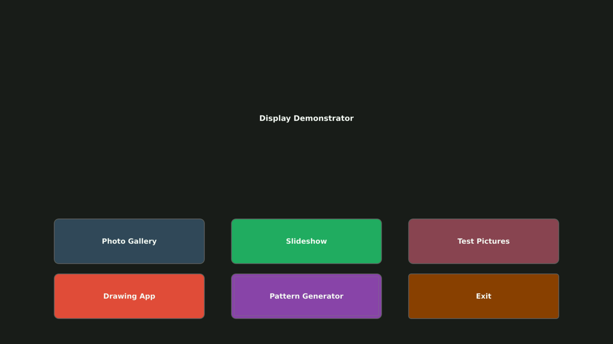

# Qt Demo Launcher(QT-Launcher Backend)

A configurable Qt-based application launcher designed for touch interfaces and embedded systems. Features both touch-based GUI interaction and network API control for automated testing and remote management, as shown below, based on json config file, different buttons of different colors can be placed as app-launcher buttons - following launcher-home-screen is rendered by [this config file.](src/qt-demo-launcher.json).


## Features

- **JSON-configurable interface** - Flexible layout and button configuration
- **Touch-optimized UI** - Full-screen interface designed for touch displays
- **Network API** - TCP-based remote control for automation
- **Process management** - Proper application lifecycle handling
- **Cross-compilation ready** - Built for embedded Linux systems

## Table of Contents

- [Installation](#installation)
- [Configuration](#configuration)
- [Usage](#usage)
- [Network API](#network-api)
- [JSON Configuration Reference](#json-configuration-reference)
- [Building](#building)
- [Examples](#examples)
- [Troubleshooting](#troubleshooting)

## Installation

### Build and deploy from Source
```bash
# Clone, build and run
git clone -b pi4-983-interrupt-touch https://github.com/hackboxguy/br-wrapper.git
cd br-wrapper/package/qt-demo-launcher/src/
sed -i 's|^\([[:space:]]*\)#include "NetworkInterface\.moc"|\1//#include "NetworkInterface.moc"|' NetworkInterface.cpp
qmake qt-demo-launcher.pro
make
./qt-demo-launcher --config qt-demo-launcher.json --port=8081
```

## Configuration

The launcher uses JSON configuration files to define the interface layout and available applications.

### Configuration File Priority
1. Command line argument (`--config /path/to/config.json`)
2. `/etc/launcher.json` (system default)
3. `./launcher.json` (current directory)
4. Built-in defaults (if no config found)

### Minimal Configuration Example
```json
{
  "launcher": {
    "title": {
      "text": "My Applications"
    },
    "buttons": [
      {
        "id": "gallery",
        "enabled": true,
        "text": "Photo Gallery",
        "program": "/usr/bin/touch-gallery",
        "arguments": ["/Pictures"]
      }
    ]
  }
}
```

## Usage

### Command Line Options
```bash
qt-demo-launcher [OPTIONS] [CONFIG_FILE]

Options:
  -c, --config FILE    Use specified JSON configuration file
  -p, --port PORT      Network interface port (default: 8081)
  -h, --help           Show help message

Examples:
  qt-demo-launcher                              # Use defaults
  qt-demo-launcher --port 8090                 # Custom port
  qt-demo-launcher --config /tmp/my-config.json # Custom config
  qt-demo-launcher /path/to/config.json --port 9000 # Both options
```

### Touch Interface

- **Tap buttons** to launch applications
- **Full-screen mode** - Applications take over entire display
- **Auto-return** - Launcher reappears when applications exit
- **Touch-optimized** - Large buttons with hover effects

### Application Lifecycle

1. **Launch** - Application starts and launcher hides
2. **Running** - Application has full screen control
3. **Exit** - Application closes and launcher reappears automatically

## Network API

The launcher provides a TCP-based API for remote control and automation.

### Connection
```bash
# Default connection
nc 192.168.1.100 8081

# Send single command
echo "command" | nc -q 0 192.168.1.100 8081
```

### Available Commands

#### `list-apps`
Lists all enabled applications from configuration.

```bash
echo "list-apps" | nc -q 0 192.168.1.100 8081
# Returns: gallery,slideshow,drawing,system,exit
```

#### `start-app <app-id>`
Launches the specified application by ID.

```bash
echo "start-app gallery" | nc -q 0 192.168.1.100 8081
# Returns: OK (on success)
# Returns: ERROR: invalid-app-name (if app doesn't exist)
# Returns: ERROR: app-already-running (if another app is running)
# Returns: ERROR: program-not-found (if executable missing)
```

#### `stop-app`
Stops the currently running application.

```bash
echo "stop-app" | nc -q 0 192.168.1.100 8081
# Returns: OK (if app was stopped)
# Returns: ERROR: no-app-running (if no app was running)
```

#### `get-running-app`
Returns the ID of the currently running application.

```bash
echo "get-running-app" | nc -q 0 192.168.1.100 8081
# Returns: gallery (if gallery is running)
# Returns: none (if no app is running)
```

### Error Responses

| Error | Description |
|-------|-------------|
| `ERROR: invalid-app-name` | App ID not found in configuration |
| `ERROR: app-already-running` | Cannot start - another app is running |
| `ERROR: program-not-found` | Executable file doesn't exist |
| `ERROR: no-app-running` | Cannot stop - no app is currently running |
| `ERROR: Unknown command` | Command not recognized |

### Process Management

- **Graceful termination** - Apps receive SIGTERM first (3-second timeout)
- **Force kill** - SIGKILL used if graceful termination fails
- **State tracking** - Proper cleanup when applications exit
- **Single app limit** - Only one application can run at a time

## JSON Configuration Reference

### Root Structure
```json
{
  "launcher": {
    "title": { ... },
    "window": { ... },
    "layout": { ... },
    "buttons": [ ... ]
  }
}
```

### Title Configuration
```json
"title": {
  "text": "Display Demonstrator",           // Title text
  "logo": "/path/to/logo.png",         // Optional logo image
  "logo_size": {
    "width": 200,
    "height": 80
  },
  "layout": "text_only",               // text_only, logo_left, logo_right, logo_top, logo_only
  "font_size": 32,                     // Title font size
  "color": "#ffffff"                   // Title text color
}
```

### Window Configuration
```json
"window": {
  "width": 2560,                       // Window width
  "height": 1440                       // Window height
}
```

### Layout Configuration
```json
"layout": {
  "type": "grid",                      // grid, vertical, horizontal
  "columns": 2,                        // Grid columns (if type=grid)
  "rows": 3,                           // Grid rows (if type=grid)
  "spacing": 30,                       // Space between buttons
  "margins": {
    "top": 100,
    "bottom": 100,
    "left": 150,
    "right": 150
  }
}
```

### Button Configuration
```json
{
  "id": "gallery",                     // Unique identifier (required)
  "enabled": true,                     // Show button (required)
  "text": "Photo Gallery",             // Button text
  "icon": "/path/to/icon.png",         // Optional icon
  "program": "/usr/bin/touch-gallery", // Executable path
  "arguments": ["/Pictures"],          // Command line arguments
  "working_directory": "/Pictures",    // Working directory
  "action": "quit",                    // Special action (quit for exit button)
  
  "position": {                        // Grid position (if layout=grid)
    "row": 0,
    "column": 0,
    "row_span": 1,
    "column_span": 1
  },
  
  "size": {                           // Button dimensions
    "width": 640,
    "height": 200
  },
  
  "icon_size": {                      // Icon dimensions
    "width": 100,
    "height": 100
  },
  
  "icon_layout": "icon_top",          // icon_left, icon_right, icon_top, icon_only, text_only
  "font_size": 30,                    // Button font size
  "background_color": "#34495E",      // Button background
  "hover_color": "#2C3E50",           // Hover state color
  "border_radius": 20                 // Corner radius
}
```

### Special Button Types

#### Exit Button
```json
{
  "id": "exit",
  "text": "Exit",
  "action": "quit",                   // Special action to quit launcher
  "background_color": "#8E4000"
}
```

#### Program Button
```json
{
  "id": "drawing",
  "text": "Drawing App",
  "program": "/usr/bin/drawing-app",
  "arguments": ["--fullscreen"],
  "working_directory": "/tmp"
}
```

## Building

### Prerequisites
- Qt5 development libraries
- C++11 compatible compiler
- Cross-compilation toolchain (for embedded targets)

### Build Configuration
The Makefile is configured for buildroot cross-compilation:

```makefile
# Key variables
STAGING_DIR     # Buildroot sysroot path
QT5_INCDIR     # Qt5 include directory
QT5_LIBDIR     # Qt5 library directory
MOC            # Meta Object Compiler path
```

### Build Commands
```bash
# git clone the sources
git clone -b pi4-983-interrupt-touch https://github.com/hackboxguy/br-wrapper.git

# cd into the sources and comment-out NetworkInterface.moc include line which is needed when building from buildroot as a package
cd br-wrapper/package/qt-demo-launcher/src/
sed -i 's|^\([[:space:]]*\)#include "NetworkInterface\.moc"|\1//#include "NetworkInterface.moc"|' NetworkInterface.cpp

# make
qmake qt-demo-launcher.pro;make

# deploy
./qt-demo-launcher --config qt-demo-launcher.json --port=8081
```

### Build Dependencies
```bash
# Ubuntu/Debian
sudo apt-get install qtbase5-dev qtbase5-dev-tools

# Buildroot (add to config)
BR2_PACKAGE_QT5=y
BR2_PACKAGE_QT5BASE=y
BR2_PACKAGE_QT5BASE_WIDGETS=y
```

## Examples

### Basic Automation Script
```bash
#!/bin/bash
HOST="192.168.1.100"
PORT="8081"

# Function to send command
send_command() {
    echo "$1" | nc -q 0 $HOST $PORT
}

# Start gallery app
echo "Starting gallery..."
send_command "start-app gallery"

# Wait 10 seconds
sleep 10

# Check if still running
STATUS=$(send_command "get-running-app")
echo "Running app: $STATUS"

# Stop the app
echo "Stopping app..."
send_command "stop-app"
```

### Configuration for Kiosk Mode
```json
{
  "launcher": {
    "title": {
      "text": "Information Kiosk",
      "font_size": 48
    },
    "window": {
      "width": 1920,
      "height": 1080
    },
    "layout": {
      "type": "vertical",
      "spacing": 50
    },
    "buttons": [
      {
        "id": "info",
        "enabled": true,
        "text": "Information Center",
        "program": "/usr/bin/info-app",
        "size": {
          "width": 800,
          "height": 200
        },
        "font_size": 36
      }
    ]
  }
}
```

### Multi-App Demo Configuration
```json
{
  "launcher": {
    "title": {
      "text": "Touch Demo Suite"
    },
    "layout": {
      "type": "grid",
      "columns": 2,
      "rows": 2,
      "spacing": 20
    },
    "buttons": [
      {
        "id": "gallery",
        "text": "Photo Gallery",
        "program": "/usr/bin/touch-gallery",
        "arguments": ["/Pictures"],
        "position": { "row": 0, "column": 0 }
      },
      {
        "id": "drawing",
        "text": "Drawing App",
        "program": "/usr/bin/drawing-app",
        "position": { "row": 0, "column": 1 }
      },
      {
        "id": "browser",
        "text": "Web Browser",
        "program": "/usr/bin/qtwebkit-browser",
        "arguments": ["--fullscreen", "http://example.com"],
        "position": { "row": 1, "column": 0 }
      },
      {
        "id": "exit",
        "text": "Exit",
        "action": "quit",
        "background_color": "#8E4000",
        "position": { "row": 1, "column": 1 }
      }
    ]
  }
}
```

## Troubleshooting

### Common Issues

#### Application Won't Start
```bash
# Check if program exists
ls -la /usr/bin/your-app

# Check permissions
chmod +x /usr/bin/your-app

# Test manually
/usr/bin/your-app

# Check launcher logs
journalctl -f | grep qt_demo_launcher
```

#### Network API Not Working
```bash
# Check if port is open
netstat -ln | grep 8081

# Test connection
telnet 192.168.1.100 8081

# Check firewall
sudo ufw status
```

#### Touch Events Not Working
```bash
# Check input devices
ls /dev/input/event*

# Verify Qt environment
export QT_QPA_PLATFORM=linuxfb
export QT_QPA_EVDEV_TOUCHSCREEN_PARAMETERS=/dev/input/event0
```

#### JSON Configuration Errors
- Validate JSON syntax using `jq` or online validator
- Check file permissions and encoding (UTF-8)
- Verify all required fields are present
- Use debug output to see config loading messages

### Debug Mode
```bash
# Enable Qt debug output
export QT_LOGGING_RULES="*.debug=true"
qt-demo-launcher --config debug-config.json

# Check debug messages
qt-demo-launcher 2>&1 | grep -E "(Config|Network|App)"
```

### Performance Issues
- Reduce button count or image sizes
- Use simpler layouts (vertical instead of grid)
- Optimize icon file sizes and formats
- Check system resources (memory, CPU)

### File System Issues
```bash
# Check disk space
df -h

# Verify directories exist
mkdir -p /Pictures /tmp/runtime-root

# Check Qt font directory
ls -la /usr/share/fonts/
```

## Environment Variables

The launcher sets up the following environment for launched applications:

```bash
QT_QPA_PLATFORM=linuxfb
QT_QPA_FB_HIDECURSOR=1
QT_QPA_EVDEV_TOUCHSCREEN_PARAMETERS=/dev/input/event0
QT_QPA_FONTDIR=/usr/share/fonts/dejavu/
XDG_RUNTIME_DIR=/tmp/runtime-root
```

## Version History

- **v2.0** - Added network API, async app launching, improved configuration
- **v1.0** - Initial release with touch interface and JSON configuration

