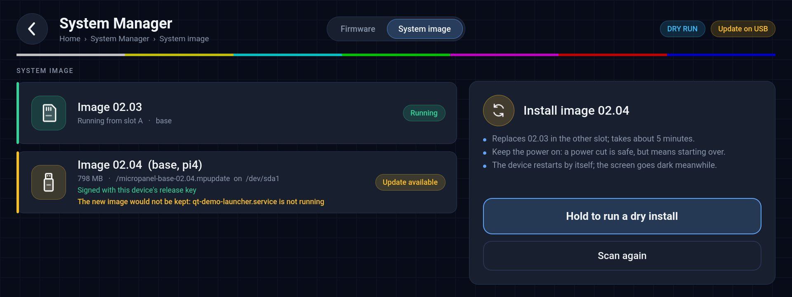

# system-manager-app

System Manager for the display rig, started from qt-demo-launcher's **System Manager** button.
Two sections, switched in the header: **Firmware** shows the firmware each board runs against the
images this system ships and installs them over I²C; **System image** installs a new SD-card
image from a USB stick on the A/B images (pi-ab-update). Later sections (FPGA update, system
status) are meant to live in the same app.

**Where it keeps things** (`<data>`): `/data/system-manager` when it exists - the A/B images,
whose root is an overlay on RAM, so only `/data` survives the reboot that ends every update.
The image's data skeleton creates it (pi-owned); on images built before that, the app creates it
once when `/data` is its own mount (without sudo first, then `sudo -n install -d`). Elsewhere
(single-slot images) `<data>` is `<prefix>/usr`. In it: `logs/system-update/` (firmware runs),
`logs/system-image-update/` (image runs and `last-install`), and `acknowledged-fallback`.
`SYSTEM_MANAGER_DATA` overrides it (tests; the badge script follows it too).



## Firmware section

| Board | Where | Notes |
|---|---|---|
| 983HH serializer board | RH850 F1KM-S1, I²C 0x67 | Always present |
| Display controller | RH850 F1KM-S1/S4 in the display, I²C 0x66 | Variant (OTS, remote display, Spartan-7/S4) picked by board code; "Not fitted" on displays without one |

The app never opens the I²C bus itself. Everything goes through `update-iocs.sh`
(space6-architecture, installed beside `disptool`):

- **Check** on start and on "Check again": `update-iocs.sh --check --image-dir <dir>` — read-only.
- **Update**, after a 1.5 s hold on the button: `update-iocs.sh --image-dir <dir> --keep-stream`.
  The script picks each board's `_ota`/`_otaB` pair by board code, quiesces the drivers and
  services that share the bus, updates the display controller first and the 983HH second, and
  leaves the video stream up so this screen stays visible where the hardware allows it.

Before the hold, the app estimates the time from the boards that need an update (about 25 s for
the 983HH, 45 s for a display controller) and says so; the progress view repeats it. It also
tells the user that the screen goes dark and stays dark: when a board restarts the panel loses
its picture and only a power cycle brings it back (seen on the 17" OLED OTS; the video link
itself recovers). So the user is told up front to wait twice the estimate, at least 2 minutes,
and then switch the system off and on. The 983HH restart also resets the 983's I2C forwarding
and interrupt setup, so touch does not work until that power cycle either.

Per-board status comes from the script's `RESULT` lines; the outcome from its exit code:

| Exit | Shown as | Offered next |
|---|---|---|
| 0 | Firmware updated — **power cycle required** | Back to home |
| 2 | The update did not finish (unit still usable) | Check again and retry |
| 3 | The update must be repeated now | Check again and retry |
| 4 | The new firmware was rolled back | Contact service |
| 5 | Update refused — this image was rolled back before | Never retried with the same image |
| 6 | A board stopped answering | Power cycle, then check |

After a successful update the app writes `Power cycle required` to `/tmp/micropanel-notice`,
which the launcher shows as an amber header chip until the next boot. The update cannot be left
from the UI while it runs, and the app ignores SIGTERM/SIGINT during it. Each run's output is
logged under `<data>/logs/system-update/`.

## System image section

On the A/B SD-card images (pi-ab-update), the **System image** tab installs a new image from a
USB stick into the inactive slot. The app is only a front end: the engine
(`/usr/local/bin/ab-update`, misc-tools `packages/pi-ab-update`) streams, verifies, arms and
**reboots by itself**; the new image commits on the next boot once it has run healthy for 30 s,
otherwise the following reboot returns to the previous slot. On an image without the engine
(`ab-update` missing, or the manifest not `IMAGE_LAYOUT=ab`) the tab says "This image does not
support in-system updates" and nothing else.

- **Scan** while the tab is on screen: the block-device inventory is polled every 2 s, and a
  change (stick in or out) runs `sudo -n system-image-scan.sh`. The scanner uses the engine's
  own USB rule - USB transport, a vfat/exfat/ntfs whole-disk filesystem or partition (NTFS is
  mounted with `ntfs3` first, then a plain `mount`, as the engine does), `*.mpupdate`
  at the **top level** of the filesystem only, exactly one across all sticks - mounts each
  filesystem `ro,nosuid,nodev,noexec` in a private directory under `/run/system-manager/`,
  reads the bundle's `manifest` and `manifest.sig` (the first two members, so the rootfs is not
  read), verifies the signature against the pinned key, and always unmounts. Bundles found in
  folders are reported separately, because the engine will not see them. Output:
  `BUNDLE device= path= bytes= version= variant= boards= format= signature=ok|bad|nokey|unreadable`,
  `NESTED device= path=`, `UNMOUNTABLE device= fstype=`,
  `SUMMARY sticks= filesystems= bundles= nested= unmountable= running= layout=ab|single`. A
  filesystem that will not mount read-only, with no bundle found anywhere, is shown as "The USB
  stick could not be read" - the engine fails such a stick as `failed-source`, not as "no bundle".
- **Offer**: the running image and slot, and the stick's bundle (version, variant, boards,
  size, signature). No button when there is no stick, no bundle, more than one, a bad
  signature, or the version already running (the engine refuses only an identical version;
  signed downgrades are allowed). No button either while the running image is still an
  uncommitted candidate - the engine leaves that guard to the UI.
- **Preflight** (UI side, the engine is unchanged): the engine keeps a new image only if every
  unit in `AB_HEALTH_UNITS` (its board config) stays active with no restarts for the settle
  window. The section checks them on the running system (`systemctl is-active`,
  `systemctl show --property=NRestarts`) when an offer appears and every 5 s while it is on
  screen; when one is down or has restarted, the offer card says "The new image would not be
  kept: <unit> is not running" (or "has restarted N times"). The install stays allowed, as in
  the engine: someone recovering a device needs exactly that.
- **Install**, after a 1.5 s hold: `sudo -n ab-update install usb`. The bar follows the
  engine's progress file (`<runtime-dir>/progress`, polled every 500 ms, never the output);
  `writing` is the long phase. The tab cannot be left, SIGTERM/SIGINT are ignored, and
  `/tmp/system-update.lock` is held. The output is logged line by line (fsync) under
  `<data>/logs/system-image-update/`, and `last-install` there records the version being
  installed (not on a dry run), so the line after the reboot can name it. If the engine's public
  status ever carries `version=`, that wins.
- **End**: `arming` shows "Rebooting into the new image…" and the engine reboots. A
  `failed-<class>` shows the class's text and whether a retry makes sense (source, payload,
  integrity and stall: yes; signature, compatibility, version and the slot classes: no;
  internal: once).
- **After the reboot**: `<runtime-dir>/status` gives `committed`, `candidate-armed` or
  `fallback`; the tab shows "Running 02.06 (committed)", "…still being verified", or "The
  update to 02.06 did not pass its health check; running 02.05 again". The app opens on this
  tab when it has such news or the last scan found an installable bundle. Opening the tab after
  a fallback writes `<data>/acknowledged-fallback` (`version=` of the install it refers to), so
  the launcher badge stops repeating it; the tab keeps the line.

The engine's paths come from its board config (`/usr/lib/pi-ab-update/ab-update.conf`,
`AB_RUNTIME_DIR`, `AB_MANIFEST`), parsed like the engine parses it; the options below override.

### Desktop run (no hardware)

`tests/fake-ab-update` stands in for the engine: it answers the queries and walks the
progress file through the phases (`FAKE_AB_STEP` seconds per step, ending in `FAKE_AB_END`,
default `arming`, or e.g. `failed-integrity`). With `--dry-run` nothing is elevated, the
scanner prints a canned bundle (or `SYSTEM_IMAGE_SCAN_FAKE=<file>`), and the real
`/usr/local/bin/ab-update` is never started:

`tests/offscreen-shots.sh <binary> <out-dir> [WxH]` renders every state to PNG with
`QT_QPA_PLATFORM=offscreen QT_QUICK_BACKEND=software` (needs the Qt SVG image plugin and the
QtQuick/QtQuick.Window QML modules), using the stand-in, `tests/fake-systemctl` for the
preflight (`FAKE_DOWN`, `FAKE_RESTARTED`), canned scans and a canned `update-iocs.sh`.
`tests/badge-fixture.sh` runs the badge script against fake status and acknowledgement records.
By hand:

```
mkdir -p /tmp/fake-ab && printf 'IMAGE_VERSION=02.05\nIMAGE_LAYOUT=ab\nIMAGE_VARIANT=base\n' > /tmp/fake-ab/manifest.env
AB_RUNTIME_DIR=/tmp/fake-ab/run FAKE_AB_STEP=0.5 ./system-manager-app --dry-run --section image \
  --ab-update ../tests/fake-ab-update --scan-tool ./system-image-scan.sh \
  --runtime-dir /tmp/fake-ab/run --image-manifest /tmp/fake-ab/manifest.env --image-log-dir /tmp/fake-ab/logs
```

## Launcher badge

`system-update-check.sh` prints one line for the launcher's badge, the most important of:
`Update rolled back` (the last image update fell back), `Update available` (a board carries
firmware other than the shipped image, same read-only check as the app), `Image update on USB`
(a stick carries exactly one signed bundle of another version; the scan also refreshes
`/run/system-manager/last-scan`). The launcher runs it as the button's `badge_command` about
20 s after start and whenever an app exits. It skips while `/tmp/system-update.lock` is held by
a running process. `Update rolled back` is shown once per fallback: after the System image tab
has been opened, `<data>/acknowledged-fallback` names the same install (the version from the
engine's status if it publishes one, else `last-install`, else `-`) and the line is skipped; a
fallback of another install shows it again.

## Options

| Option | Default | Purpose |
|---|---|---|
| `--update-tool <path>` | `<bindir>/update-iocs.sh` | The update script |
| `--image-dir <dir>` | `<prefix>/share/sp6bins/firmware/bios-bin` | Shipped firmware images |
| `--log-dir <dir>` | `<data>/logs/system-update` | Firmware update logs |
| `--notice-file <path>` | `/tmp/micropanel-notice` | Launcher header notice |
| `--dry-run` | off | Check images and show the flow; nothing is written |
| `--auto-update` | off | Automated validation: start the update as soon as a check finds one (no hold) |
| `--ab-update <path>` | `/usr/local/bin/ab-update` | pi-ab-update front end (System image) |
| `--scan-tool <path>` | `<bindir>/system-image-scan.sh` | USB bundle scanner |
| `--runtime-dir <dir>` | engine config `AB_RUNTIME_DIR`, else `/run/ab-update` | Engine progress and status files |
| `--image-manifest <path>` | engine config `AB_MANIFEST`, else `<prefix>/share/micropanel/image-manifest.env` | Running image manifest |
| `--image-log-dir <dir>` | `<data>/logs/system-image-update` | Image update logs and `last-install` |
| `--systemctl <path>` | `systemctl` | What the preflight asks (test seam) |
| `--screenshot <file>` | off | Grab the window once the shown section has its first result, then quit |
| `--screenshot-delay <ms>` | 1200 | Time between that result and the grab |
| `--window-size WxH` | full screen | Window size (with `--screenshot`, e.g. 1920x720 offscreen) |
| `--auto-install` | off | Automated validation: install the bundle a scan offers, once, 3 s after the offer (no hold) |
| `--section firmware\|image` | image when it has news, else firmware | Tab to open first |

`<bindir>` is the directory of the binary and `<prefix>` its parent, so the defaults work for
both `/home/pi/micropanel/bin` (PiOS) and `/usr/bin` (Buildroot).

## Build

Part of the br-wrapper CMake build (`add_subdirectory(package/system-manager-app)`) and a
Buildroot package (`BR2_PACKAGE_SYSTEM_MANAGER_APP`). Needs Qt 5.15 (Quick, QML); no Quick
Controls.
